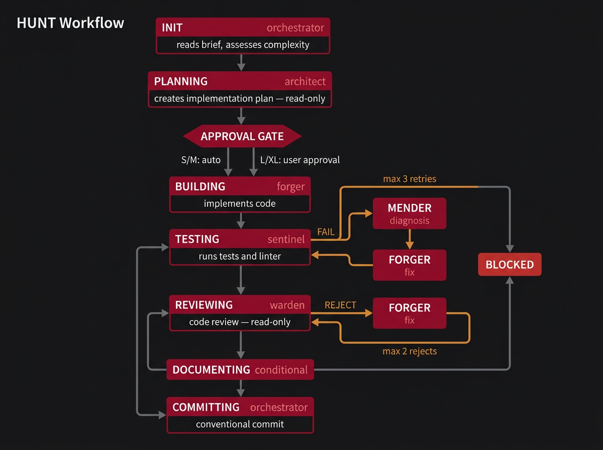
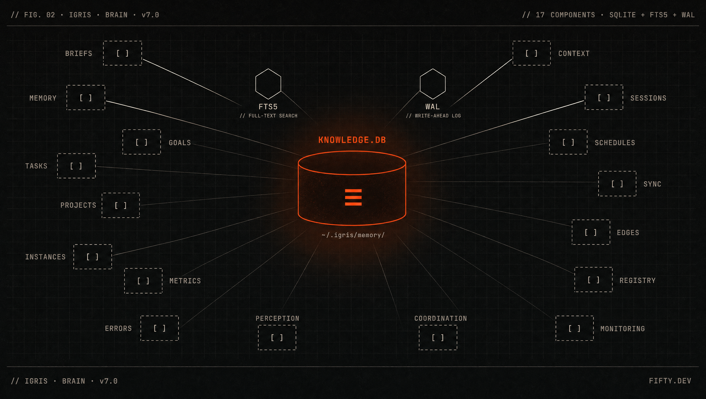

# Igris AI

The engineering operating system for Claude Code.

Brief-first. Brain-backed. Self-healing.

**7 Agents** | **20 Skills** | **91 MCP Tools** | **34 REST Endpoints**

---

## The Problem

AI made coding faster. It did not make it better.

- You shipped a 2000-line PR because the AI never stopped to plan.
- Your context reset mid-task and you rebuilt everything from scratch.
- Three developers prompted the same fix because nobody tracked who was doing what.
- Your AI wrote code that passed tests but violated your architecture.
- Technical debt compounded with every prompt because nothing enforced standards between sessions.

Speed without structure is not engineering. It is chaos with better autocomplete.

---

## What Igris Does

Five pillars. Each one solves a failure mode that no prompt engineering can fix.

### 1. Brief-First Protocol

Every file modification requires a tracked brief. No brief, no write access.

Briefs define what to build, why it matters, how to verify it, and what constraints apply. Nine types cover the full engineering lifecycle:

| Type | Prefix | Purpose |
|------|--------|---------|
| Bug/Feature | BR | General bugs and features |
| Feature Request | FR | New feature ideas |
| Technical Debt | TD | Code quality improvements |
| Migration | MG | System migrations |
| Testing | TS | Test additions/improvements |
| Process Improvement | PI | Workflow improvements |
| Dependency Update | DU | Dependency updates |
| Performance | PF | Performance improvements |
| Architecture Cleanup | AC | Architecture refactoring |

Each brief carries priority, effort estimate, acceptance criteria, test plan, and full lifecycle tracking from Draft through Archived. Read-only operations -- research, questions, listing -- do not require briefs. Everything that writes a file does.

This is not a convention. It is enforced. The system blocks file modifications without a brief.

### 2. Autonomous HUNT Workflow

```
/hunt BR-005
```

One command. Full pipeline. No hand-holding.

HUNT triggers autonomous end-to-end implementation: plan, build, test, review, document, commit. Each phase is handled by a specialized agent. If tests fail, the system self-heals -- mender diagnoses, forger fixes, sentinel re-tests. Up to 3 retries before the brief enters BLOCKED state for human intervention.

This is the hero feature. Details in [The HUNT Workflow](#the-hunt-workflow).

### 3. The Brain

Centralized at `~/.igris/`. SQLite WAL + FTS5. 91 MCP tools across 16 components. 34 REST API endpoints.

The brain remembers across projects, sessions, and context resets. Error catalogs, pattern suggestions, velocity metrics, cross-project learnings -- all stored in a single database, all searchable with full-text search, all accessible via MCP or HTTP.

When your context resets, the brain does not. It tells your next session exactly where you left off and what to do next.

### 4. Seven Agents, Enforced Roles

The architect plans. The forger builds. The sentinel tests. The warden reviews.

These are not suggestions. Tool restrictions are enforced at the agent definition level. The architect has `Read, Grep, Glob` -- it cannot write files. The warden has the same constraint. Separation of concerns is not a guideline; it is a hard boundary.

The seeker runs on `model: haiku` for fast, low-cost codebase exploration. Every agent has `memory: project`, persisting context across sessions in `.claude/agent-memory/<name>/`.

### 5. Zero-Drift Installation

Igris installs via symlinks from `~/.igris/core/` into your project. Update the brain once, every project gets the update instantly.

No copy drift. No sync scripts. No version mismatch between projects. One source of truth, linked everywhere.

---

## The HUNT Workflow

```
/hunt BR-005
```



**Eight phases, fully autonomous.** The orchestrator reads the brief, the architect plans (read-only), the forger builds, the sentinel tests, the warden reviews (read-only), and the orchestrator commits. Documenting runs conditionally for new APIs and component changes.

**Self-healing loop:** Test failures route through mender (diagnosis) and forger (fix) automatically. Three failures and the brief enters BLOCKED -- human intervention required. Review rejections follow the same pattern with a two-reject limit.

**Context reset recovery:** If your session resets mid-HUNT, Igris reads `CURRENT_SESSION.md`, finds the active brief, checks its workflow phase, and resumes from the exact step. "TESTING phase, retry 2/3" -- not "start over."

---

## The Brain



### 91 MCP Tools (16 Components)

Tools are available globally via the `igris-brain` MCP server.

| Component | Tools | Purpose |
|-----------|-------|---------|
| Memory | 7 | Store, search, recall, hybrid search, embedding backfill |
| Errors | 3 | Lookup, similar errors, embedding backfill |
| Projects | 3 | Register, list, status |
| Metrics | 3 | Record, query, velocity dashboards |
| Sessions | 4 | Sync, recall, file get/update |
| Briefs | 9 | CRUD, sync, dashboard, file management, similar, velocity |
| Tasks | 13 | Create, claim, assign, block, complete, fail, retry, list, results |
| Instances | 4 | Heartbeat, list, remove, agent events |
| Sync | 11 | Push/pull brain data, queue management, file/session/brief/definition sync |
| Cache | 2 | Rebuild/clean brain-to-filesystem cache |
| Context | 4 | Register, get, load, tree routing (v6) |
| Schedules | 7 | Create, list, get, enable/disable, fire, delete |
| Coordination | 7 | Auto-route, priorities, config, audit, agent capabilities |
| Monitoring | 2 | Event log, event log cleanup |
| Registry | 6 | Module/template registry: add, search, get, list, remove, update |
| Edges | 6 | Typed graph edges + traversal: create/list/remove + neighbors/path/subgraph |

### 34 REST API Endpoints

Full HTTP API with API key authentication, rate limiting, and SSE streaming.

| Category | Endpoints | Highlights |
|----------|-----------|------------|
| Health & Status | 3 | Health check, brain stats, sync status |
| Projects | 3 | List, budget get/set |
| Briefs | 3 | List, velocity, brief content |
| Sessions | 2 | List sessions, session files |
| Tasks | 6 | List, next, claim, complete, fail, release |
| Instances | 5 | List, heartbeat, delete, agent list, activity log |
| Events | 2 | Query event log, SSE streaming |
| Metrics | 3 | Agent summary, by-project, record |
| Hooks | 2 | Hook event ingestion, agent event recording |
| Sync | 4 | Push, pull, file push, file pull |
| Definitions | 1 | Pull definitions |

### Brain Modes

| Mode | Entry Point | Use Case |
|------|-------------|----------|
| `local` | `igris-brain` (stdio) | Single machine, default |
| `remote` | `igris-brain` (HTTP) | VPS brain, no local DB |
| `dual` | Both (stdio + HTTP) | Full redundancy |

```bash
./scripts/igris_brain_switch.sh status   # Show current mode
./scripts/igris_brain_switch.sh local    # Local only
./scripts/igris_brain_switch.sh remote   # Remote only
./scripts/igris_brain_switch.sh dual     # Both active
```

### Concurrency

Multiple Claude sessions safely share the brain:

- SQLite WAL mode for concurrent reads and serialized writes (~3ms each)
- `busy_timeout=5000ms` for automatic retry on contention
- Staging pattern: hooks write unique files, processed on next startup

### Worker Daemon

`igris_worker.sh` runs as a background daemon, polling the brain for tasks and spawning Claude Code sessions to execute them autonomously. Six task handler types (dev, content, research, media-gen, operational, social-media) define how each task is processed. Concurrency control, heartbeat monitoring, and clean shutdown built in.

```bash
./scripts/igris_worker.sh start    # Start the daemon
./scripts/igris_worker.sh status   # Check status
./scripts/igris_worker.sh stop     # Clean shutdown
```

---

## Agents and Skills

### 7 Agents

Defined as native Claude Code agent files in `.claude/agents/`.

| Agent | Tier | Role | Tools | Model |
|-------|------|------|-------|-------|
| **architect** | 1 - Core | Strategic planning, brief analysis | Read, Grep, Glob | inherit |
| **forger** | 1 - Core | Code implementation | Read, Write, Edit, Bash, Grep, Glob | inherit |
| **sentinel** | 1 - Core | Test execution, validation | Read, Bash, Grep | inherit |
| **warden** | 1 - Core | Code review, security, auditing | Read, Grep, Glob | inherit |
| **mender** | 3 - Maintenance | Error diagnosis, self-healing | Read, Grep, Glob, Bash | inherit |
| **seeker** | 4 - Research | Codebase investigation | Read, Grep, Glob, Bash | haiku |
| **sage** | 5 - Custom | Flutter MVVM + Actions patterns | Read, Write, Edit, Bash, Glob, Grep | inherit |

**Design decisions:**

- **Read-only enforcement.** Architect and warden cannot write files. This is not a prompt instruction -- it is a tool restriction in the agent definition. The planner cannot implement. The reviewer cannot fix.
- **Lightweight research.** Seeker uses `model: haiku` for fast, low-cost codebase exploration. Research does not need the full model.
- **Persistent memory.** Every agent has `memory: project`, storing learned context in `.claude/agent-memory/<name>/` across sessions. The architect remembers past plans. The warden remembers past review patterns.

### 20 Skills

Slash commands defined in `.claude/skills/*/SKILL.md`.

| Skill | Purpose |
|-------|---------|
| `/scan` | System status report |
| `/rest` | Pause or end session |
| `/awaken` | Start or resume session |
| `/register` | Create new brief |
| `/archive` | Archive completed brief |
| `/hunt` | Autonomous implementation (full pipeline) |
| `/digivolve` | Agent management and status |
| `/document` | Documentation generation |
| `/release` | Release preparation, changelog, versioning |
| `/standardize` | Generate coding guidelines (4 modes) |
| `/ideate` | Feature brainstorming, generates FR briefs |
| `/migrate-analyze` | Migration analysis and roadmap |
| `/audit` | Codebase audit (7 types), generates briefs |
| `/ui-design` | UI specs, design systems, accessibility |
| `/team` | Parallel execution with Agent Teams |
| `/projects` | List all brain-registered projects |
| `/portfolio` | Cross-project dashboard |
| `/dashboard` | Cross-project brief and session tracker |
| `/sync` | VPS brain deployment and synchronization |
| `/fifty-kit` | Fifty Flutter Kit expert |

### Agent Teams

An experimental parallel execution layer that spawns multiple independent Claude Code instances working simultaneously.

**Requires:** `CLAUDE_CODE_EXPERIMENTAL_AGENT_TEAMS: 1` in `~/.claude/settings.json`

| Mode | Command | What Happens |
|------|---------|--------------|
| Parallel HUNT | `/team hunt FR-022 FR-023` | Each brief gets its own Claude instance |
| Multi-Angle Review | `/team review` | 3 reviewers: security, performance, standards |
| Competitive Investigation | `/team investigate BR-015` | Multiple hypotheses tested in parallel |
| Parallel Refactoring | `/team refactor mod-a mod-b` | Each module refactored independently |

Quality gates are enforced via hooks: `TaskCompleted` verifies test evidence before allowing completion. `TeammateIdle` auto-assigns the next brain task to idle teammates.

Single brief -- use `/hunt`. Multiple briefs -- use `/team hunt`.

---

## Quick Start

### Prerequisites

| Required | Purpose |
|----------|---------|
| Git | Version control |
| Claude Code CLI | AI engine |
| Bash | macOS, Linux, or WSL |
| Node.js 20+ | Brain MCP server |
| Python 3 | JSON parsing, brain operations |
| SQLite 3 (FTS5) | Brain database |

**Optional:** jq (faster JSON parsing in hooks -- python3 fallback available)

### Install

```bash
# Clone Igris
git clone https://github.com/fiftynotai/igris-ai

# Bootstrap the brain (one-time)
./igris-ai/scripts/igris_brain_init.sh

# Install in your project
cd your-project
path/to/igris-ai/scripts/igris_install.sh
```

This creates `~/.igris/` with the brain database, copies core files (agents, skills, rules, prompts, context tree), and sets up `.claude/` symlinks. Registers the brain MCP server globally in `~/.claude.json`. Your project gets the full system with zero file duplication.

### First 5 Minutes

```bash
# Launch Claude Code
claude

# Generate coding guidelines from your codebase
/standardize analyze

# Register your first task
"Register a bug: Login fails with special characters in password"

# Autonomous implementation
/hunt BR-001
```

Igris plans (architect), implements (forger), tests (sentinel), reviews (warden), documents if needed, and commits with conventional format. One command.

### Essential Commands

| Command | What It Does |
|---------|-------------|
| `/hunt BR-XXX` | Autonomous implementation |
| `/scan` | System status report |
| `/register` | Create new brief |
| `/archive BR-XXX` | Archive completed brief |
| `/standardize analyze` | Generate coding guidelines |
| `/audit code_quality` | Run codebase audit |
| `/team hunt FR-001 FR-002` | Parallel implementation |
| `/dashboard` | Cross-project brief tracker |

---

## Why Igris

Honest comparison. No competitor has all five pillars.

| Capability | Igris | Multi-Agent Frameworks | AI IDEs |
|------------|-------|------------------------|---------|
| Brief-first audit trail | Enforced -- 9 types, full lifecycle | No | No |
| Cross-project brain | SQLite WAL + FTS5, 91 MCP tools | File-based or none | Session-only |
| Self-healing pipeline | mender + sentinel, 3 retries | Manual intervention | Manual intervention |
| Zero-drift install | Symlinks from single brain | Copy-based, drift-prone | N/A |
| Tool-enforced roles | Agent definitions restrict tools | Prompt-based, bypassable | N/A |
| Parallel execution | Agent Teams with quality gates | Some support | No |
| Persistent memory | Survives resets, syncs cross-project | Memory banks (file-based) | Session-only |
| Worker daemon | Background task execution | No | No |
| Identity system | SOUL.md + USER.md, 4 mask levels | No | No |

**What this means in practice:**

- **vs. multi-agent frameworks** (Ruflo, Oh-My-ClaudeCode, metaswarm): They have agents. Igris has agents with enforced tool restrictions, a persistent brain, brief-first audit trail, and self-healing pipelines. More agents is not the differentiator -- discipline is.
- **vs. AI IDEs** (Cursor, Copilot): They accelerate typing. Igris manages engineering workflow. Different problems, different tools.
- **vs. memory-focused tools** (Claude CodePro): File-based memory banks per project. Igris has a database-backed brain that works across projects, survives context resets, and serves 91 tools via MCP.

---

## FAQ

**Does Igris work with Claude.ai (web)?**
No. Igris requires Claude Code CLI for hooks, subagents (Task tool), MCP tools, and skills. The web interface does not support these features.

**Can I use Igris with other AI CLIs?**
Currently built for Claude Code. The v6 context architecture is CLI-agnostic -- any tool that can query brain MCP tools can resolve the context tree. Cross-CLI adapters are on the roadmap.

**Do I need briefs for everything?**
Only for file modifications. Research, questions, analysis, listing -- all brief-free.

**What happens when my context resets?**
Igris reads session state and brief workflow phase, then resumes from the exact step. No restart. No rework.

**Can I disable agents?**
Yes. Remove or rename the agent `.md` file in `.claude/agents/`, or use `/digivolve disable {name}`.

**Why is the architect read-only?**
The agent that plans should not be the agent that implements. Tool restrictions enforce this at the definition level, not the prompt level. Same principle applies to the warden -- the reviewer cannot fix what it rejects.

**How does self-healing work?**
When sentinel detects test failure, mender analyzes the error, forger applies the fix, sentinel re-tests. Up to 3 cycles. If all fail, the brief enters BLOCKED state and waits for you.

**What is the worker daemon?**
`igris_worker.sh` runs in the background, polling the brain for queued tasks and spawning Claude Code sessions to execute them. Autonomous background processing with concurrency control.

---

## Documentation

| Resource | Location |
|----------|----------|
| Operating System | `~/.igris/core/prompts/igris_os.md` |
| Context Tree | `~/.igris/core/igris_tree.json` |
| Setup Guide | `docs/SETUP_GUIDE.md` |
| Update Guide | `docs/UPDATE_GUIDE.md` |
| Migration Guide | `docs/MIGRATION_GUIDE.md` |
| Brand Book | `docs/IGRIS_BRAND_BOOK.md` |
| Contributing | `CONTRIBUTING.md` |

---

## Community

- **Repository:** [github.com/fiftynotai/igris-ai](https://github.com/fiftynotai/igris-ai)
- **Issues:** [Report bugs, request features](https://github.com/fiftynotai/igris-ai/issues)
- **Discussions:** [Share ideas, get help](https://github.com/fiftynotai/igris-ai/discussions)
- **Example Project:** [igris_ai_flutter_example](https://github.com/fiftynotai/igris_ai_flutter_example)
- **Contributing:** See [CONTRIBUTING.md](CONTRIBUTING.md)

---

**Version 6.0.0** | [MIT License](LICENSE)

Built by [Fifty.ai](https://github.com/fiftynotai)
