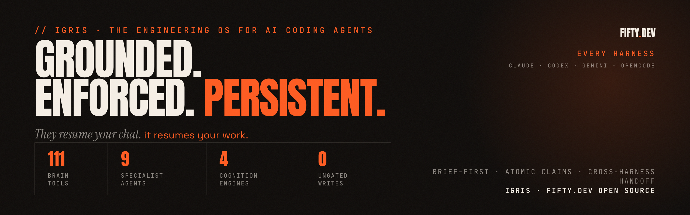
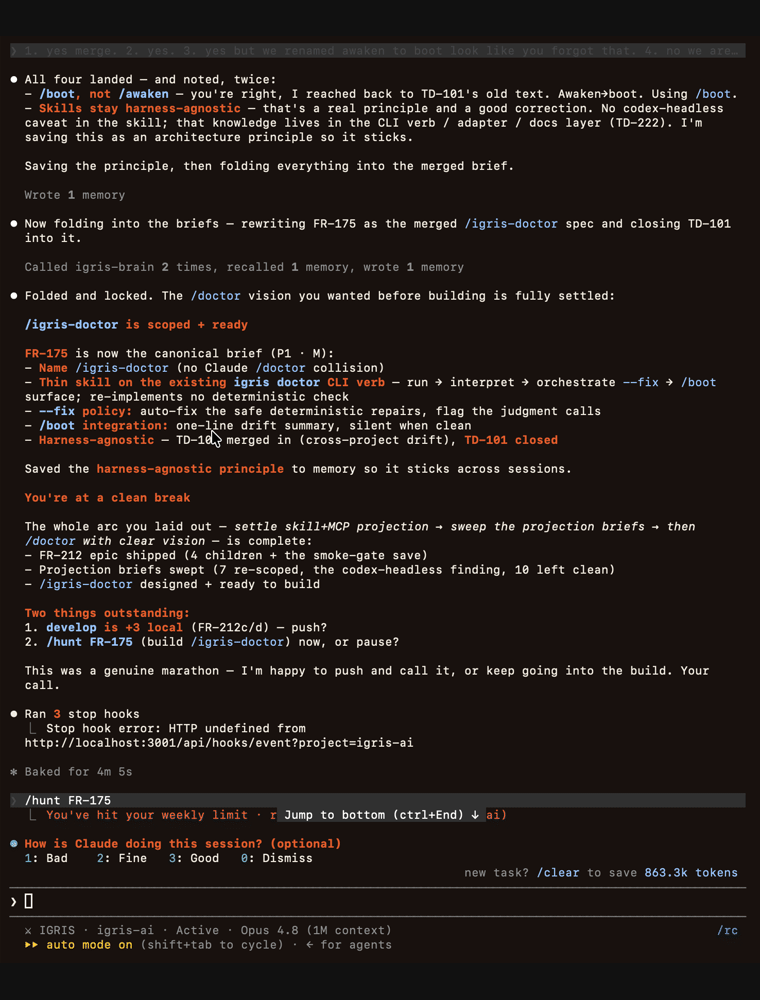

# IGRIS

they resume your chat — IGRIS resumes your work.

the engineering OS for AI coding agents: cross-harness work-state handoff, enforcement-as-code, and one brain across every harness.

---

## ai made coding faster. it did not make it better.

you shipped a 2000-line pr because nothing stopped you. your context reset mid-task and you rebuilt from scratch. three sessions prompted the same fix because nobody tracked who was doing what.

speed without structure is not engineering. it is chaos with better autocomplete.

IGRIS is the workbench around the model. it makes the brief the contract, makes the phase explicit, makes ownership atomic, and makes every write pass through gates the agent cannot talk its way around.

## what IGRIS adds.

| Spearhead | What changes |
|-----------|--------------|
| Bounded-role delivery pipeline | `/hunt` takes one brief through architect -> forger -> sentinel -> warden -> commit, each a separate role with its own tools. A failing test or a review REJECT loops back and re-verifies before anything lands. |
| Self-healing test failures | A failed test routes to a diagnosis role that looks the error up against a memory of fingerprinted failures — known cause and fix, matched by cause not file or line — before it retries, and records every verified fix so the next occurrence resolves on sight. It recovers up to three times, then stops and hands you a diagnosed blocker instead of thrashing. |
| Cross-harness work-state handoff | A new harness resumes the actual work state: brief, phase, atomic claim, instance identity, supersession lifecycle, working tree, and agent log. |
| Enforcement-as-code | Brief-first write gates, role tool restrictions, test phases, and review phases are installed as executable workflow constraints the agent cannot talk its way around. |
| One brain across every harness | SQLite + FTS5 at `~/.igris/memory/knowledge.db` stores briefs, sessions, plans, learnings, claims, and sync state for every registered project. |
| Learns while you work | Background cognition mines your sessions into reusable learnings, surfaces suggestions from the whole-brain digest, and keeps memory deduped and hygienic. The OS sharpens the more you run it. |
| A graph, not just a list | Briefs, learnings, and decisions link through typed edges (`depends_on`, `supersedes`, `derived_from`), so dependency chains and the lineage of a decision stay queryable instead of scrolling off in a flat log. |
| Grounded in your project | Per-project context docs (coding guidelines, architecture map, test standards) the agent consults before it writes and maintains when it changes them, so it follows your conventions, not generic defaults. |
| Extends itself | `igris add skill\|agent\|mcp\|hook` grows the OS and projects the new surface to every harness at once; self-describing modules are auto-discovered, with no registry to hand-edit. |
| Portable across machines and people | The brain syncs to a central store so your work follows you between machines, and `/handoff` exports a project slice as a portable bundle a colleague imports into their own install. |
| Reuse before rewrite | A catalog of proven modules and templates (`/reuse`, `/harvest`) so the agent reaches for an existing block before rebuilding one. |

First-class harnesses: Claude Code, OpenCode, and Antigravity. Codex and Gemini CLI are supported bridges.

Cursor remains an onboarding target, not a shipped surface.

## the idea.

most AI coding tools are a smarter autocomplete with memory bolted on. IGRIS inverts it: a persistent operating system the model runs inside.

the model is the CPU. IGRIS is the OS. every session boots it, mounts your project, runs your work — then saves state back, so the next session picks up exactly where you left off.

the payoff is an agent that actually knows your project — its conventions, its decisions, its open work, the mistakes already made — not for one chat, but across every session you run.

## the flagship proof.

your agent hits its weekly usage limit in the middle of a task. you switch to a different tool, from a different vendor — and it starts up already knowing exactly what to pick up next.

the storyboard below is exactly that: Claude stops at its limit right after settling on the next task to run, then Codex — a separate agent — boots fresh and recommends that same task on its own. nothing was copied between them: no prompt, no pasted transcript.



that works because IGRIS never hands off a conversation. it hands off your work state — the task, where it sits in the workflow, and the code already in progress — so whichever harness you open next continues instead of restarting. the same handoff has been proven end-to-end across four tools: Claude, OpenCode, Codex, and Antigravity.

## the lifecycle.

every session starts with `/boot` and ends with `/rest`. in between, the agent is grounded, not guessing.

`/boot` runs the boot sequence:

- **detect** — the harness (Claude, OpenCode, Antigravity, Codex, Gemini) and its capabilities.
- **boot** — load the OS: who the agent is, how it must operate, what it can do.
- **login** — load who you are and how you work.
- **mount** — pull the brain, restore session state, surface where your work stands: active brief, phase, blockers, what's next.

`/rest` closes the session: it writes your work-state — mode, active brief, next steps, the uncommitted lay of the land — to the brain and syncs it. nothing is a transcript; everything is state.

so a `/boot` in a different harness resumes the actual work, not a summary of it. because the brain syncs to a central store, that state travels across machines too — full cross-machine handoff is the frontier we're proving now (see the edges below).

## the core workflow.

`/hunt` runs the pipeline end-to-end. architect plans, forger builds, sentinel tests, warden reviews, orchestrator commits. one command. bounded roles.

```text
$ /hunt TD-161

[architect]  planning  · plan written to ~/.igris/projects/igris-ai/plans/TD-161-plan.md
[forger]     building  · core/SOUL.md edited · mirror cp ~/.igris/core/SOUL.md
[sentinel]   testing   · verify_mirror.sh -> verdict: MATCH (1 pair, 0 mismatch)
[sentinel]   testing   · git grep "Crimson" -- ':!docs/archive/' ':!CHANGELOG.md' -> 0 matches
[warden]     reviewing · brand canon audit · IGRIS-native register restored · APPROVE
[orchestrator] CHANGELOG.md amended in place · TD-160 bullet refined with TD-161 note

result: ready for commit · 1 file changed · 0 retries · PASS
```

and when a test fails, the pipeline doesn't just retry and hope. it routes to a diagnosis role that first looks the error up in a memory of past failures — fingerprinted by cause, not file or line, so a fix learned once matches the same break anywhere — applies the known remedy, and re-verifies. a fix confirmed by a green test is recorded, so the next time that failure appears it resolves on sight. three misses and it stops and hands you a diagnosed blocker, not a thrashing loop.

## the gates.

a rule in a prompt is a suggestion the model can rationalize its way past. IGRIS installs the rules as executable gates instead — enforcement the agent runs into, not reads.

- **brief-first.** no file gets written without a brief for the work. a pre-write hook blocks the edit; the escape hatch is logged and audited, not a sentence the agent can argue with.
- **phase discipline.** the workflow is a state machine — plan, build, test, review, commit. a pre-commit gate blocks a commit made out of phase. you can't ship code that skipped review.
- **bounded roles.** each agent gets only the tools its job needs. the tester can't write code; the reviewer can't edit; the builder can't self-approve. separation of duties, enforced by tool restriction, not by asking nicely.
- **commit standards + secret scanning.** conventional-commit format and a secret scan run on every commit, at the hook level.

the point isn't ceremony. it's that the guarantees hold even when the model is confident, tired, or wrong — because they're code, not vibes.

## grounding.

a fresh model writes generic code. a grounded one writes your code.

`/ground` authors your project's context docs — coding guidelines, architecture map, design system, test standards, API patterns — and the OS consults the right one before it works. the agent follows your conventions and boundaries because they're written down and routed to it, not re-guessed every session.

## the cognition layer.

memory you tell it is half the story. the cognition layer is the other half — memory the OS infers.

it's a host that runs small, single-purpose instances. each one observes the brain and proposes something for you to review. one job each:

- **perception** — reads your session transcripts, proposes the learnings worth keeping.
- **subconscious** — reads the brain's state, surfaces suggestions: a stalled brief, a gap, a pattern worth acting on.
- **synapse** — infers the relationships between learnings and draws the edges.
- **janitor** — finds near-duplicate learnings and proposes the merge.
- **arbiter** — catches two learnings that contradict and resolves which one wins.
- **curator** — flags learnings that have gone stale and proposes pruning them.
- **cartographer** — clusters related learnings and distills each cluster into one meta-learning.

nothing here writes to your memory behind your back. every instance proposes; you approve. the OS sharpens itself while you're away — you stay in control of what it learns.

and the layer is open. a new instance is a new self-describing file; the host doesn't change. teaching the OS a new kind of reflection is the same move as adding a skill or an agent — drop it in, it's discovered, it runs.

it ships **off by default** — nothing is observed until you turn it on. enable the instances you want in `~/.igris/config.json` (`cognition.<instance>.enabled: true`); the flags, budgets, and review-gate knobs are documented in [`docs/COGNITION.md`](docs/COGNITION.md).

## one fact, one home.

the agent doesn't have "a memory." it has several knowledge bases, each holding one kind of knowledge, each authoritative for its kind:

- **the brain** — *experience.* the lessons, decisions, and mistakes it accumulates by working: what worked, what broke, the non-obvious rationale. evolving, confidence-scored, searchable.
- **context docs** — *standards.* your project's authoritative conventions: coding guidelines, architecture, design system, test standards, API patterns. structured, curated, the source of truth for how you build.
- **the catalog** — *reusable assets.* the "lego" blocks worth reaching for again: templates, modules, packages, and where each one lives.
- **the code** is ground truth and **git** is history — the agent reads them, it never copies them into memory.

the rule that keeps it clean: **one fact, one home.** each piece of knowledge routes to the store that matches its kind and lives in exactly one place. when a fact changes kind — a lesson that hardens into a standard — it moves, it isn't duplicated.

the skills are the pipes between the stores:

- **`/ground`** authors your context docs — turns "how this project builds" into a written standard the agent consults before it works.
- **`/harvest`** mines a finished project: the lessons flow into the brain, the reusable modules into the catalog, the shape of the project into the registry.
- **`/promote`** graduates a hardened lesson out of the brain into a context doc — the brain is the staging area, the doc is the curated home, promotion is the pipeline (and it leaves a lineage breadcrumb behind).
- **`/reuse`** reaches into the catalog before you rebuild something that already exists.
- the **cognition layer** feeds the brain — proposed learnings, waiting for your review.

so when the agent needs to know something, it knows where to look: experience in the brain, standards in the docs, blocks in the catalog. no single bucket that rots into a junk drawer.

## the architecture.

IGRIS is built like an OS so it can grow without rotting.

- **layers, not a monolith.** every concern — identity, conduct, capabilities, protocols, memory — is one layer with one job and one way to extend it. adding a skill, agent, harness, or doc-type is a known move, not a refactor.
- **self-describing, self-assembling.** modules declare their own metadata; the OS discovers them and generates its own index. no hand-maintained registry to drift.
- **contract vs. implementation.** what the model reads never names the code behind it, so any mechanism swaps without touching what the agent understands.
- **agnostic core, per-harness adapters.** the skills and the OS are harness-neutral; each harness gets a thin adapter. one behavior, every surface.

that discipline is why the same brief, brain, and lifecycle work identically whether you boot Claude, OpenCode, or Antigravity.

## every harness, honestly.

IGRIS runs the same brain, briefs, and lifecycle across every harness it supports. what it won't do is pretend they're identical — so it adapts to each, and it's honest about where a harness falls short.

the OS core is harness-agnostic; each harness gets a thin adapter that maps the OS onto what that harness actually exposes:

- **skills, agents, and MCP** project to every supported harness — write a skill once, they all get it.
- **enforcement gates are hooks**, so they need a hook API. Claude Code and OpenCode run the full set (brief-first, phase guard, commit + secret scans); Codex gets the session-level subset; Gemini and Antigravity expose no hook API, so there the gates soften to advisories — the workflow still runs, the blocking doesn't.
- **delegation adapts.** a harness with native subagents uses them; one that defines its agents at runtime gets a per-harness recipe (its `harness-specific` file) so "delegate to the reviewer" resolves the same way everywhere — the skill never knows the difference.

onboarding a new harness is declarative: describe it once in the manifest — agents, MCP, hooks, delegation model — and `/onboard-harness` projects every surface it can support and wires the adapter for the rest. a new harness is a descriptor, not a fork.

## it extends itself.

most tools you extend by editing them. IGRIS you extend by declaring — and it wires the rest.

the agent knows how to grow itself in every direction, and each direction is a defined connection point:

- **a surface** — a skill, an agent, an MCP server, a hook, or an identity — added with one command (`igris add skill …`) and projected to every harness at once. write it once; Claude, OpenCode, and Antigravity all get it.
- **an OS module** — a new capability or rule: drop a self-describing file into the OS and it's discovered and indexed. no registry to hand-edit.
- **a doc-type** — a new kind of project context doc: declare it in the catalog and the knowledge-map absorbs it.
- **a cognition instance** — a new kind of background reflection: drop a self-describing extractor and the host runs it, unchanged.
- **a harness** — a new CLI or IDE: onboard it, and every skill, agent, and gate it already has reaches the new surface.

the throughline: nothing here is ad-hoc. every extension is either self-describing and discovered, or it follows a defined procedure — never a one-off. the OS grows the same disciplined way it does everything else: a known move, not a rewrite. it even knows how to add a whole new layer to itself.

that is the line between a tool with plugins and an OS that extends itself — the agent doesn't just use its capabilities, it can add new ones, and know exactly where each belongs.

## it checks its own health.

an OS spread across harnesses, machines, and projects drifts: a hook goes stale, a symlink breaks, a config wanders from canonical. IGRIS finds that itself.

`/igris-doctor` scans every registered project and each harness for drift — missing or stale hooks, broken bridges, config that no longer matches canonical — and reports every issue with its fix. `/boot` surfaces a one-line summary so you catch drift before it bites.

the OS that installs itself and extends itself is the same one that keeps itself honest.

## install in three commands.

```bash
npm install -g igris-ai
igris init
cd /path/to/your-project && igris install .
```

`igris init` bootstraps the centralized brain and projects skills, agents, MCP, and hooks globally. `igris install .` is register-only: it records the project in the brain so the global surfaces apply, without copying IGRIS files into your repo.

Restart your harness afterward so it loads the `igris-brain` MCP server, then run `/boot` and follow the first-run prompt into `/setup` — a 2-minute guided first hunt that teaches the register → hunt → rest loop (and later reconfigures your install). Install matrix, verification commands, and upgrade paths live in [`docs/SETUP_GUIDE.md`](docs/SETUP_GUIDE.md) and [`docs/UPDATE_GUIDE.md`](docs/UPDATE_GUIDE.md).

## project handoff.

`/boot` and `/sync` move your work-state across your own machines through the central brain. `/handoff` moves a single project to someone else's installation — a colleague covering while you are out, a contractor, a fresh machine with its own brain — as a portable file. no shared brain required; the bundle is the transport.

```text
$ /handoff export igris-ai
# -> igris-ai.igris-pack.tar.gz  (briefs + brief graph + context docs + goals)
```

hand the bundle over (slack, email, usb). on the other side:

```text
$ /handoff import igris-ai.igris-pack.tar.gz
# preview: 604 new, 0 conflict -> confirm -> applied
```

what travels is a **project slice**, not your whole brain: the project's briefs and their dependency graph, its context docs, and its goals by default (`--tier core` for briefs only; `--tier full` adds learnings, error fingerprints, and the concept graph). machine-local state never leaves — no sessions, no instance claims, no metrics, no secrets, and no executable code.

import is reviewed, never silent. it classifies every row as new, unchanged, or conflict against a local ancestor record, waits for your confirm, and applies the policy you choose (`--on-conflict theirs|mine|newer`). a row you and the other side both changed is flagged, not clobbered — so a hand-off today and a hand-back on your return each keep their own edits. re-importing the same bundle is a no-op. if the receiving machine does not know the project yet, import registers it automatically.

## essential skills.

| Need | Skills |
|------|--------|
| Onboard a new install, or reconfigure later | `/setup` |
| Start and end grounded work | `/boot`, `/rest` |
| Create, run, inspect, and close briefs | `/register`, `/hunt`, `/scan`, `/archive` |
| Capture and harden reusable knowledge | `/harvest`, `/promote` |
| Reuse proven assets before rebuilding | `/reuse` |
| Generate project context docs | `/ground` |
| Sync code or brain data | `/sync` |
| Hand off or take over a project | `/handoff` |

## why not just compose other tools?

You can get pieces of this elsewhere: spec-first planning, shared rule files, agent memory, and lightweight checkpointing. That stack is real, useful, and often enough.

IGRIS is for the failure mode where pieces are not enough: multiple harnesses, multiple sessions, mid-workflow interruption, write enforcement, stale claims, crash recovery, cross-project memory, and sync all need one lifecycle. The detailed comparison is in [`docs/substitution.md`](docs/substitution.md).

## the unfinished edges.

- Agent teams (`/team hunt`) remain experimental. Parallelism works; the ergonomics are still being hardened.
- Resume path was proven in B2, but deterministic phase entry is still being tightened so every harness follows the same skip/re-walk behavior.
- Cross-machine B2 is the next frontier; same-machine cross-harness is proven.
- Some brain components are mature and heavily used. Others are intentionally parked until a real workflow needs them.

## three doors.

- build log -> [fifty.dev/journal](https://fifty.dev/journal)
- the repo -> [github.com/fiftynotai/igris-ai](https://github.com/fiftynotai/igris-ai)
- the license -> [mit](LICENSE)
