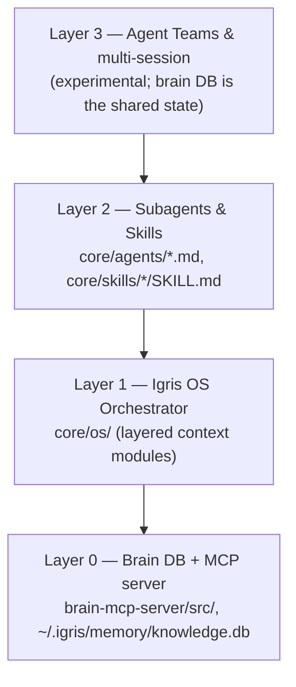
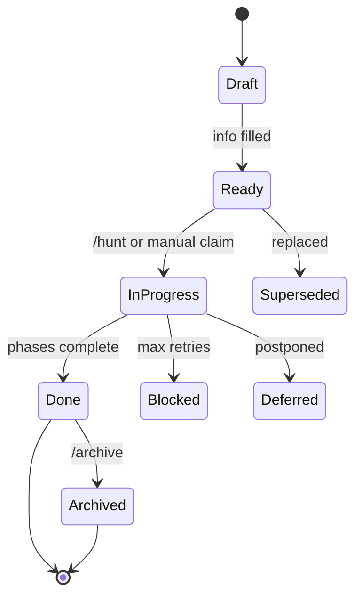
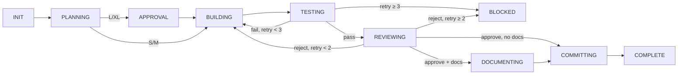
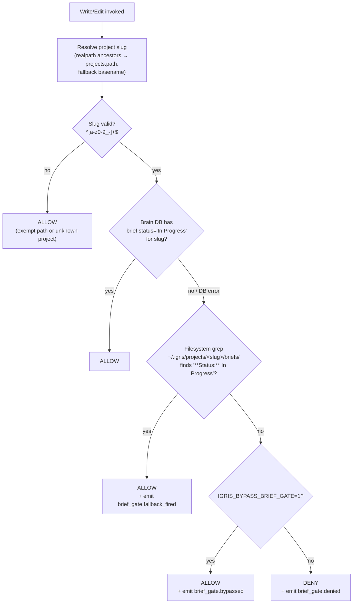
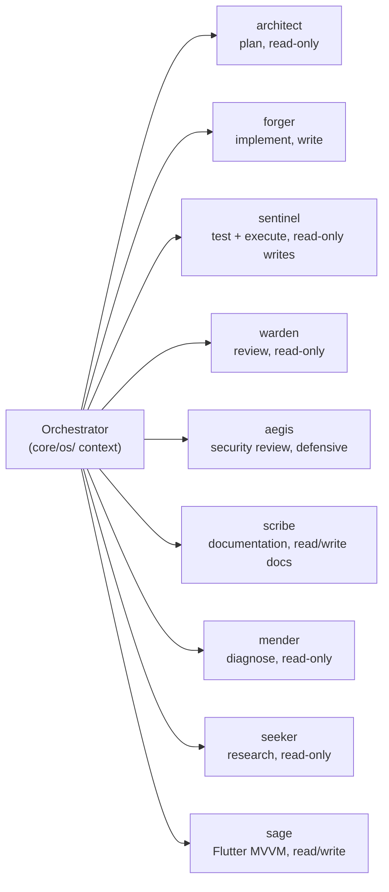

# Igris AI System Architecture — How the Pieces Fit

> Contributor-facing map of the system. Start here if you're new. Drill into the per-feature docs (linked below) for any specific subsystem. The per-feature docs in `docs/architecture/*.md` are the source of truth for their subsystems; this doc summarizes and cross-links.

---

## 1. The 30-Second Pitch

Igris AI is an **open-source AI engineering OS** that orchestrates agent teams to implement software with human oversight. A local **brain** (SQLite + FTS5 + sqlite-vec) at `~/.igris/memory/knowledge.db` stores briefs, learnings, errors, tasks, perception events, and metrics. A unified `igris` CLI manages installation, sync, and lifecycle. The orchestrator (Claude Code grounded via the `/boot` ceremony, which loads the layered OS context from `core/os/INDEX.md`) enforces a **brief-first protocol** and delegates work to specialized agents discovered from `core/agents/*.md`. An optional VPS acts as an **async backup hub + dashboard backend + cross-machine sync**; local is always authoritative.

---

## 2. The 4-Layer Stack



| Layer | Role | Primary entry-point |
|-------|------|---------------------|
| **0 — Brain DB + MCP server** | Authoritative state: briefs, learnings, errors, tasks, events, perception. Tools served via the `igris-brain` MCP server with `additionalProperties: false` strict-input contract. | `brain-mcp-server/src/index.ts:1-250`; engine boot at `brain-mcp-server/src/engine/index.ts:71-144` |
| **1 — Igris OS orchestrator** | Single Claude Code session that loads the layered OS context (via the `core/os/INDEX.md` module map), enforces brief-first protocol, tracks session state, and delegates to agents via the `Agent` tool. | `~/.igris/core/os/INDEX.md` + the boot-tier modules it lists (also live at `core/os/` in the repo) |
| **2 — Subagents + skills** | The specialized agents (read or write tools restricted at the definition level) and the slash-command skills that compose multi-step workflows. | `~/.igris/core/agents/*.md`, `~/.igris/core/skills/*/SKILL.md` |
| **3 — Agent Teams / multi-session** | Experimental layer that spawns parallel Claude Code instances; coordination via the shared brain DB and the VPS replication hub. | `core/skills/team/SKILL.md`; status: experimental |

---

## 3. The Brain DB

**Engine:** TypeScript MCP server (`brain-mcp-server/`) booted by the unified `igris` CLI. Database is SQLite WAL mode with FTS5 and sqlite-vec extensions; busy timeout is 30 s. Static schema migrations live in `brain-mcp-server/src/db.ts` (v1–v25+); each component runs its own programmatic migrations at boot (`engine/index.ts:123`).

**The 19 components** (booted in dependency order at `engine/index.ts:94-114`):

| # | Component | Purpose (one sentence) |
|---|-----------|------------------------|
| 1 | `memory` | Learnings DB with FTS5 + 384-D vector search; auto-promotes to global scope at 2+ projects |
| 2 | `errors` | Error catalog & root-cause analysis |
| 3 | `projects` | Registry of installed projects (path, slug, status, config) |
| 4 | `context` | Cache of context files (coding guidelines, architecture maps, etc.) |
| 5 | `metrics` | Agent performance telemetry (tools used, error rates, latency) |
| 6 | `sessions` | Session lifecycle bookkeeping |
| 7 | `briefs` | Brief storage with status & phase tracking |
| 8 | `edges` | Typed entity relationships (FR-105) — provenance graph |
| 9 | `goals` | Outcome-level goal tracking (FR-110) |
| 10 | `tasks` | Autonomous task queue (v3 schema with retry + capability gates) |
| 11 | `instances` | Agent instance lifecycle (run ID, hostname, model, tokens) |
| 12 | `sync` | VPS sync queue & replication state |
| 13 | `cache` | Brain-to-filesystem cache (v6 read-only backup) |
| 14 | `schedules` | Cron schedule + event-based triggers |
| 15 | `coordination` | Autonomous decision rules & coordination config |
| 16 | `subconscious` | Rule-based anomaly detection (**DISABLED in v7**; see §3.1) |
| 17 | `perception` | Observation & pattern extraction from sessions |
| 18 | `monitoring` | Agent & system observability (activity, SLA) |
| 19 | `registry` | Reusable-assets catalog (templates/modules — the "lego" store; FR-099/FR-198) |

**Tool count:** 120+ brain tools distributed across the 19 components (the `igris-brain` MCP server is the single gateway). Every tool's `inputSchema` declares `additionalProperties: false` (TD-128 strict-input contract; enforced at `brain-mcp-server/src/engine/gateway.ts:47-138`). Callers must use allowlists when forwarding queue entries or external payloads (see `cli/src/lib/sync/data.ts:224`).

**Key tables** (subset; the per-component schema files are the source of truth):

| Table | Purpose |
|-------|---------|
| `brief_status` | Canonical brief catalog (id, project, type, status, priority, effort, phase, timestamps) |
| `brief_files` | Brief markdown archive (immutable audit trail) |
| `learnings` + `learnings_fts` + `learnings_vec` | Auto-extracted knowledge with BM25 ranking & 384-D vectors |
| `errors` | Error catalog & RCA |
| `event_log` | Audit trail of all events (used for perception extraction) |
| `projects` | Installed projects registry |
| `entity_edges` | Typed relationships across briefs, learnings, errors, sessions, goals |
| `sync_queue` | VPS replication backlog (JSONL-style queue, drained on `/boot`/`/rest`/`/sync`) |

### 3.1 Mirror invariant (TD-096)

`~/.igris/core/` mirrors repo `core/` byte-for-byte. Edit the repo copy and run `igris refresh` (or, for in-place patches, the explicit `cp <repo-core> ~/.igris/core/<same-path>` + `bash core/scripts/verify_mirror.sh <pair>` protocol). The mirror is verified with the `verify_mirror.sh` primitive: realpath-resolved, exit-code-checked, one verdict per pair. Sentinel's MIRROR_CHECK runs the same primitive at `/hunt TESTING` and blocks the commit on any MISMATCH. See `core/scripts/verify_mirror.sh` and CONTRIBUTING.md "Documentation invariants" #5.

### 3.2 Subconscious disabled (TD-102 / FR-118)

The rule-based subconscious detectors (`subconscious_engine.md`) had a 2% true-positive rate in Phase 2 live runs and trained users to ignore diagnostics. v7 sets `~/.igris/config.json:subconscious.enabled = false` and both schedule rows are disabled; existing pending suggestions are bulk-dismissed with the reason `"subconscious paused pending FR-118 redesign (TD-102)"`. The ~6.6 kLOC engine is preserved as reference material; FR-118 redesign is the path to re-enable.

### 3.3 Deliberate graceful-degradation choices

These are intentional, not bugs — documented openly because a stated limitation is maturity:

- **No auto-release listener on `brief.completed`** — releasing or archiving a completed brief is an explicit operator action, never an automatic side-effect of completion (Lock-1: nothing auto-ships or auto-destroys). You `/archive` or `/release` deliberately.
- **Agent events are fire-and-forget** — `igris_agent_event` emissions during `/hunt` never block the workflow and can gap silently if the brain MCP is briefly unavailable. The dashboard may under-count a phase; the hunt itself is never delayed or failed by a missed event. Correctness over telemetry completeness.

---

## 4. The Brief Lifecycle

### 4.1 Statuses & state machine



Five main statuses (`Draft`, `Ready`, `In Progress`, `Done`, `Archived`) plus three auxiliary (`Deferred`, `Blocked`, `Superseded`). Terminal statuses (`Done`, `Archived`) emit a single `brief.completed` event; a guard prevents double-fire (`briefs/index.ts` TERMINAL_STATUSES logic).

### 4.2 The 9 brief types

| Type | Prefix | Purpose | Example |
|------|--------|---------|---------|
| Bug Report / Fix | **BR** | Production fixes, stability | BR-042 — Fix crash on null input |
| Feature | **FR** | New functionality | FR-009 — Add webhook support |
| Technical Debt | **TD** | Refactoring, cleanup, optimization | TD-145 — Remove legacy v4 patterns |
| Migration | **MG** | Data/schema migration, version upgrade | MG-008 — Migrate to Postgres 15 |
| Testing | **TS** | Test suite improvements | TS-031 — Add integration tests for sync |
| Process Improvement | **PI** | Workflow, CI/CD, tooling | PI-012 — Add pre-commit linter |
| Documentation Update | **DU** | Docs-only changes | DU-003 — Write migration guide |
| Performance | **PF** | Latency, throughput, resource use | PF-018 — Index learnings table |
| Architectural Change | **AC** | System-design shift | AC-005 — Refactor event bus |

**Auto-numbering:** scan existing briefs (brain DB `brief_status` or `~/.igris/projects/{slug}/briefs/`), find the highest `{TYPE}-\d+` ID, increment. Documented in the `/register` skill (`core/skills/register/SKILL.md`).

### 4.3 The `/hunt` workflow phases



Agents per phase: `PLANNING` → architect; `BUILDING` → forger; `TESTING` → sentinel (with mender on self-heal diagnosis; orchestrator applies the suggested fix); `REVIEWING` → warden; `DOCUMENTING` → `/document` skill (orchestrator-level, not delegated to an agent). `COMMITTING` is owned by the orchestrator, not forger (see L-248, PI-004). Full state-machine reference: `core/skills/hunt/SKILL.md`.

**Escape hatches** (one-shot, never `export`, loud + event-logged):
- `IGRIS_BYPASS_BRIEF_GATE=1` — bypass the brief-gate hook for one command.
- `IGRIS_BYPASS_PHASE_GUARD=1` — bypass the phase-guard pre-commit hook for one commit. The guard discovers the Active Brief from the brain `instances` registry (machine-scoped, freshest activity timestamp), with a per-instance session-file fallback — not the retired `CURRENT_SESSION.md` (re-pointed under FR-186 / G-01R).
- `IGRIS_ALLOW_INSECURE_SYNC=1` — allow remote VPS sync over plain `http://` to a non-local host (TD-252). By default the transport classifier (`cli/src/lib/sync-transport.ts`) REFUSES non-local `http://` because the `api_key` would travel in cleartext; this override allows it with a loud per-sync warning. `https://` and `http://` to localhost (`127.0.0.1`/`::1`) are always allowed. Also settable persistently as `config.json` `remote_brain.allow_insecure: true`.

---

## 5. The Hooks Layer

### 5.1 Hook events

**Igris-managed** (in `core/hooks/canonical-settings.json`, materialized into `.claude/settings.json` by `igris install` via `cli/src/lib/canonical-hooks.ts`):

`SessionStart`, `SessionEnd`, `PreCompact`, `PostCompact`, `PreToolUse` (Write|Edit matcher), `PostToolUse` (Write|Edit matcher, 20 s timeout).

**Claude-only** (project-local in `.claude/settings.json`; merged but not Igris-owned):

`SubagentStart`, `SubagentStop`, `Stop`, `Notification`, `TaskCompleted`, `TeammateIdle`.

The merge logic in `cli/src/lib/json-merge.ts` (`mergeCanonicalHooks()`) preserves project-local Claude hooks and inserts Igris hooks first.

### 5.2 PreToolUse brief-gate resolution



**Resolution order** (cite `core/hooks/shared/pre_tool_use.sh:23-36`):
1. Brain DB query: `SELECT brief_id FROM brief_status WHERE project = '{slug}' AND status = 'In Progress'`.
2. If brain miss / error → filesystem grep against `~/.igris/projects/{slug}/briefs/*.md`; emit `brief_gate.fallback_fired`.
3. If both empty → DENY and emit `brief_gate.denied`.

**No caching post-TD-150** — every gate call queries the brain fresh. The filesystem fallback is a correctness safeguard, not a performance optimization. `emit_brief_gate_event()` is best-effort: errors are swallowed and never block the gate.

### 5.3 PostToolUse — dispatcher + linter

`post_tool_use.sh` discovers handlers via `find post_tool_use.d/ -executable -type f | sort` (lexicographic). Currently one handler: `01-lint.sh`. Handlers must exit 0 even on lint fail; logs go to `~/.igris/projects/{slug}/session/lint.log`.

### 5.4 Cross-CLI hook bridges

Adapters under `core/hooks/bridges/` let non-Claude CLIs (OpenCode, Codex, Gemini) emit Igris-compatible events. Configuration: `~/.igris/config.json:cli_targets.*.hooks`. See [`docs/multi-cli.md`](../multi-cli.md) and [`docs/HOOK_EVENT_SCHEMA.md`](../HOOK_EVENT_SCHEMA.md) for the dispatcher contract.

---

## 6. The Sync Model

**Principle:** the local brain DB is always authoritative. The VPS is the **always-on peer** that local brains sync to and offload long-running work to — not a backup, not the source of truth. If the VPS is unavailable, the engineer's work continues uninterrupted; on the next connectivity, `/boot` pulls any VPS changes and merges them locally.

**VPS roles (5):**
1. Cross-machine sync hub — machine A's push is visible to machine B on next `/boot` pull. Local CLIs push deltas via `brain_push_async.sh` on session end.
2. Dashboard backend — serves the web UI at `/dashboard`.
3. Scheduler — owns cron-style routines (`igris_schedule_*`) that fire without local presence.
4. Hook event sink — local CLI POSTs hook events to `/api/hooks/event` for cross-machine observability.
5. Code repo mirror — `igris sync code` rsyncs the repo to VPS (separate from brain sync).

**Mental model:** local brains are the active drivers (low-latency stdio MCP, offline-tolerant). The VPS is the persistent peer they sync deltas to when the operator's session ends. Wiping the VPS does not lose the local brain — but it does lose the scheduler state, dashboard history, and cross-machine merge point. Treat it as a peer node, not a copy.

**Sync queue mechanism:** `sync_queue.jsonl` per project holds rows that failed to push. On the next `/boot`, `/rest`, or `/sync data`, the `igris_sync_queue_drain` tool retries each row. Callers must use `ALLOWED_KEYS_PER_OP` (in `cli/src/lib/sync/data.ts:224`) to build tool args — never spread arbitrary JSON from queue entries (TD-128 strict-input contract).

**Egress disclosure + path redaction (TD-253):** what egresses to the VPS is disclosed in a generated manifest — [`docs/reference/sync-egress-manifest.md`](../reference/sync-egress-manifest.md) — derived from `SYNC_TABLES` (`brain-mcp-server/src/tools/sync.ts`), the single source of truth, and drift-guarded by a parity test. Before egress, absolute local filesystem paths (`projects.path`, `instances.project_path`) are relativized (home → `~`, foreign-absolute → basename) at all three push choke points via `redactTablesForEgress`, applied BEFORE chunking and the failure-retry queue so retries never leak. The disclosure is surfaced at the `igris init` / `igris configure` VPS consent prompt and in `igris sync data --dry-run`.

**Auto-push pattern (TD-080):** background actors (perception extractor today, FR-118 subconscious tomorrow) invoke `core/hooks/shared/brain_push_async.sh` synchronously; callers detach via `nohup ... & disown`. The helper reads remote config from `~/.igris/config.json`, always exits 0, logs to `~/.igris/projects/{slug}/session/brain_push.log` with 1 MB rotation, and is silent when the remote is unconfigured.

---

## 7. Agent + Skill Orchestration

### 7.1 The 9-agent roster



The table below lists each agent's `tools:` from its YAML frontmatter (`core/agents/<name>.md`) verbatim. Tool restrictions are enforced at the agent-definition level, not by prompt. The **Mode** column summarizes the agent's own `CORE IDENTITY` line so the read-only vs read/write contract is unambiguous.

| Agent | Role | Mode | Tools (verbatim from YAML) | When invoked |
|-------|------|------|---------------------------|--------------|
| **architect** | Strategic planning, impact analysis | Read-only (NEVER writes code) | `Read, Grep, Glob` | `/hunt` PLANNING; brief analysis |
| **forger** | Code implementation | Read/Write (WRITES code) | `Read, Write, Edit, Bash, Grep, Glob` | `/hunt` BUILDING |
| **sentinel** | Test execution & validation | Read + Execute (RUNS tests, does not write code) | `Read, Bash, Grep` | `/hunt` TESTING |
| **warden** | Code review & security guardian | Read-only (REVIEWS, never modifies) | `Read, Grep, Glob` | `/hunt` REVIEWING; `/audit` |
| **aegis** | Security review & threat analysis | Defensive review/hardening | `Read, Grep, Glob, Bash, Write, Edit` | On-demand for security review, threat modeling, and hardening |
| **scribe** | Documentation | Clarifying docs/comments only | `Read, Write, Edit, Grep, Glob` | On-demand documentation work; `/document` remains the orchestrator-level skill |
| **mender** | Error diagnosis & recovery | Read-only (DIAGNOSES, does not fix directly) | `Read, Grep, Glob, Bash, mcp__igris-brain__igris_error_lookup` | Auto on test/commit failure (self-heal); orchestrator applies fixes |
| **seeker** | Codebase research & investigation | Read-only (EXPLORES, does not modify) | `Read, Grep, Glob, Bash` (model: `haiku`) | On-demand; `/audit`; research questions |
| **sage** | Flutter MVVM + Actions domain expert | Read/Write (IMPLEMENTS Flutter code) | `Read, Write, Edit, Bash, Glob, Grep` | On-demand for Flutter MVVM work (custom Tier-5 agent; not part of `/hunt` by default) |

Each agent's own CONTEXT PROTOCOL (in `core/agents/<name>.md`) names the context files it loads directly — self-contained, no routing tree (FR-187: `igris_tree.json` retired). E.g. architect loads `coding_guidelines` + `architecture_map`; forger adds `api_pattern`, plus `design_system` if the task is UI-flagged. The `/document` skill in `/hunt` DOCUMENTING is an orchestrator-level operation (not delegated to an agent).

### 7.2 The skills (grouped by purpose)

| Group | Skills |
|-------|--------|
| **Lifecycle** | `/boot`, `/rest`, `/hunt`, `/igris-doctor` |
| **Brief management** | `/register`, `/archive`, `/scan` |
| **Documentation & quality** | `/document`, `/audit`, `/ground` |
| **Knowledge & reuse** | `/harvest`, `/promote`, `/reuse` |
| **Collaboration & visibility** | `/team`, `/ops` |
| **Utilities** | `/sync`, `/release`, `/ideate` |
| **Brand & design** | `/visualize` |
| **Migrations & harness** | `/migrate-analyze`, `/onboard-harness` |

Each skill is `core/skills/<name>/SKILL.md` with YAML frontmatter (allowed tools, triggers, etc.).

#### 7.2.1 Skill tiers (FR-205 classification)

FR-205 tags each surviving SKILL.md with a `tier:` frontmatter field. This is a
**classification only** — it records intent for downstream briefs and adds no
filtering or distribution logic. **FR-191** ("the door") owns the future
default-install essentials-only filter; **FR-206** ("the store") owns opt-in
distribution of the opt-in tier. FR-205 changes no projection: every tagged skill
still projects exactly as before.

| Tier | Skills | Meaning |
|------|--------|---------|
| **essential** (13) | `/boot`, `/rest`, `/register`, `/hunt`, `/scan`, `/archive`, `/harvest`, `/promote`, `/reuse`, `/ground`, `/sync`, `/igris-doctor`, `/ops` | The core workflow, diagnostics, and cross-project command center — shipped to every default install (FR-191's filter target). |
| **opt-in** (7) | `/team`, `/audit`, `/document`, `/release`, `/ideate`, `/migrate-analyze`, `/visualize` | Useful but not core — distributed opt-in (FR-206's channel target); FR-205 only classifies them, does NOT remove them from projection. |
| **personal** (1) | `fifty-kit` | Machine/operator-personal; moved out of `core/skills/` to the FR-155 project-scoped personal overlay (no longer in consumer projection). |
| **pending** (1) | `/onboard-harness` (TD-266) | Tiering DEFERRED to the owning brief — left untagged by FR-205. |

`/ui-design` was DELETED by FR-205 (no consumers). `/dashboard` and `/projects`
were retired by FR-207 and the interim `/portfolio` name was renamed by TD-278 into `/ops`. `fifty-kit` was removed from the
consumer skill surface and now lives only in the operator's personal overlay.

### 7.3 Orchestrator-delegates principle

The orchestrator does not implement; it routes. On a `/hunt`, the orchestrator parses intent, loads the skill, and calls each agent via the `Agent` tool with the brief content + context files. Each agent completes and returns a structured result; the orchestrator evaluates and routes to the next phase. The full Subagent Delegation Protocol is the `delegation` module at `core/os/delegation.md`.

---

## 8. Extension Points — "How Do I Add X?"

### 8.1 Add a brain MCP tool

File: `brain-mcp-server/src/engine/components/<component>/index.ts`.

1. Add the tool to the component's `tools()` factory return array.
2. Define the input schema with `additionalProperties: false` (TD-128 mandate).
3. Write the handler; use helpers from `../../helpers.js` as needed.
4. Register via `{ name, description, inputSchema, handler }`.
5. Document the tool in the per-feature `docs/architecture/<component>.md` (and in `core/prompts/brain_stewardship.md` if it is a READ surface).

The `gateway-strict-input.test.ts` parameterised suite asserts the contract for every registered tool — no test add needed unless the component is new.

### 8.2 Add a hook handler

File: `core/hooks/shared/post_tool_use.d/<NN>-name.sh` (executable).

1. Shebang `#!/bin/bash`; `chmod +x`.
2. Read `$TOOL_NAME` and `$FILE_PATH` from env (or parse stdin JSON).
3. Exit 0 even on inner failure (don't break subsequent handlers).
4. Log to `~/.igris/projects/{slug}/session/<name>.log`.
5. Sync to runtime: `igris refresh` or follow the TD-096 mirror-sync protocol (`cp` + `verify_mirror.sh`).
6. Document the handler in [`docs/HOOK_EVENT_SCHEMA.md`](../HOOK_EVENT_SCHEMA.md).

### 8.3 Add a skill

File: `core/skills/<name>/SKILL.md`.

```yaml
---
name: skill_name
description: Short description
disable-model-invocation: false
allowed-tools: [Read, Write, Edit, Bash, Agent]
triggers: ["trigger phrase", "alt phrase"]
---
```

1. Body: explanation, usage examples, state machine (if multi-phase).
2. Add the skill to the §7.2 grouped table above (the human-readable skill
   roster). The `core/skills/*` tree is the canonical enumeration; do NOT
   write the skill name into `CLAUDE.md` — it carries no enumeration (TD-267;
   the boot-pointer defers identity/routing to `/boot` + `core/os/INDEX.md`).
3. Mirror the skill to `~/.igris/core/skills/<name>/SKILL.md` (TD-096) and verify with `core/scripts/verify_mirror.sh`.

### 8.4 Add an agent

Files: `core/agents/<name>.md` (definition — the agent's own CONTEXT PROTOCOL names the docs it loads) + the repo-root `harness-manifest.json` entry. Re-run `core/scripts/gen_os_index.sh` so the agent's frontmatter is discovered into the `core/os/INDEX.md` roster (FR-187 Phase 2b — no `igris_tree.json` / CLAUDE.md enumeration writes). The `igris add agent --core` verb does all of this in one pass.

```yaml
---
name: agent_name
description: What this agent does
tools: [Read, Bash, Grep, Agent]
model: inherit
memory: project
---

# AGENT_NAME

## CORE IDENTITY
- Persona: ...
- Tier: ...
- Role: ...
- Mode: read-only or write
- Focus: ...

## CONTEXT PROTOCOL
## CAPABILITIES
## WORKFLOW
## OUTPUT FORMAT
## CONSTRAINTS
```

Agent registration:

1. Put the canonical prompt at `core/agents/<name>.md` with `name`, `description`, and `tools` frontmatter.
2. Add role/tier metadata to `core/agents/manifest.yaml`.
3. Add per-harness projection targets to the repo-root `harness-manifest.json`.
4. Run `core/scripts/gen_os_index.sh` so `core/os/INDEX.md` discovers the agent roster from frontmatter.
5. Run the harness compile/drift path so Codex, Gemini, and OpenCode projections match the canonical prompt.

The **live** agent roster is discovered from each agent's own frontmatter (`name`/`description` in `core/agents/<name>.md`) into the `core/os/INDEX.md` "Agent roster" by `core/scripts/gen_os_index.sh` (FR-187 Phase 2b). `core/agents/manifest.yaml` supplies role/tier metadata and is retained for that; the retired routing-tree agent map is gone.

### 8.5 Add a brief type

1. Choose a 2-letter ASCII prefix not already taken (BR/FR/TD/MG/TS/PI/DU/PF/AC are reserved).
2. Add the definition to the `/register` skill (`core/skills/register/SKILL.md`) brief-type list.
3. Auto-numbering inherits — no code change needed.

### 8.6 Add a feature flag

1. Add the default to `cli/src/lib/templates/config.json.tmpl` (the canonical default-flag source).
2. Scripts read via `jq -r '.features.<flag>' ~/.igris/config.json`.

---

## 9. Invariants

1. **Brief-first protocol** — every file modification requires an active `In Progress` brief. Enforced by `pre_tool_use.sh`; bypass only via `IGRIS_BYPASS_BRIEF_GATE=1` (one-shot).
2. **Mirror invariant (TD-096)** — `~/.igris/core/` mirrors repo `core/` byte-for-byte. Verify with `core/scripts/verify_mirror.sh`; sentinel runs MIRROR_CHECK on every changed `core/` file.
3. **Strict-input MCP gateway (TD-128)** — every brain tool's `inputSchema` declares `additionalProperties: false`; callers use `ALLOWED_KEYS_PER_OP` allowlists.
4. **Local-primary sync** — never treat the VPS as authoritative; on divergence, trust the local DB.
5. **Carried-but-not-committed drift** — `.claude/agent-memory/*/MEMORY.md`, `brain-mcp-server/.claude/`, and `.igris_version` regenerate post-install and are gitignored or carried-not-committed. Do not "clean" them in a code-touching commit. (`CLAUDE.md` is a static boot-pointer that nothing regenerates — TD-267; FR-191 retired its render.)
6. **Igris-managed vs Claude-only hooks** — Igris hooks live only in `canonical-settings.json`; project-local Claude hooks go in a separate `.claude/settings.json` block and are preserved by the canonical merge.
7. **Forger does NOT commit** — `/hunt`'s state machine owns `COMMITTING`; sentinel runs tests, warden reviews, orchestrator commits. Forger stops at the last code-touching step and reports `IMPLEMENTATION COMPLETE — UNCOMMITTED` (L-248 / PI-004).
8. **Version sweep on bumps** — bumping the current-system version means sweeping every enumeration surface: `package.json`, `CONTRIBUTING.md` "Project structure", any README banner. `CLAUDE.md` carries no version string (TD-267 — boot-pointer only). TD-147 is the cautionary tale.
9. **Secret-scanning gate (TD-159)** — no secret-shaped string (public IP outside RFC-1918/loopback, API-key shapes, SSH/cloud keys, the operator-VPS-IP family) reaches a commit. Deterministic `gitleaks` runs at four layers: pre-commit hook (`gitleaks protect --staged`), CI (`.github/workflows/secrets-scan.yml`), warden's review checklist, and CONTRIBUTING.md Documentation Invariant #9. Config: `.gitleaks.toml`. Use placeholders/`${ENV}` indirection, never literals; allowlist a true false positive with an inline `# gitleaks:allow` marker. TD-157 is the cautionary tale (the IP leak that survived 5 hunts + every other gate). Full guide: [`docs/operations/secret-scanning.md`](../operations/secret-scanning.md).

---

## 10. v4 → v7 in 25 lines

- **v4 (pre-2025):** briefs lived in a repo `ai/` folder; no persistent brain; fragmented prompts.
- **v5 (early 2025):** SQLite brain introduced (FTS5); brain was a *cache* of VPS (VPS-first). Perception extraction added.
- **v6 (Q1–Q2 2025):** VPS role flipped — local DB became authoritative, VPS became an async backup hub. Unified `igris` CLI introduced. `igris_tree.json` routing landed; CLAUDE.md slimmed from 93 KB → 5 KB. Mask system retired (single fixed voice in SOUL.md). 5 numbered rules consolidated into one universal rule.
- **v7 (Q2–Q3 2025; current):** brain MCP server runs locally (no remote dependency for local work); brief-storage is brain-DB-first, filesystem cache is fallback; the OS context is the layered, self-describing `core/os/` module set with a generated `core/os/INDEX.md` routing map (FR-187 retired the `igris_os.md` monolith + the `igris_tree.json` routing tree); 19-component brain engine; subconscious detectors disabled pending FR-118; brief-gate hardened post-TD-150 (no 60 s caching, fresh DB query every time); v7 cleanup pass (TD-147 / TD-148) purged version-string drift and dead scripts.

Migration: v4 → v5 was a one-time `ai/`-to-brain copy; v5 → v6 used `igris upgrade`; v6 → v7 is an in-place `igris init --upgrade` (preserves `knowledge.db`, `USER.md`, `config.json` byte-for-byte). Full archive: `docs/archive/`.

---

## 11. See Also

**Per-feature architecture deep-dives** (sources of truth for each subsystem):

- [`docs/architecture/typed_edges.md`](./typed_edges.md) — Entity graph (FR-105).
- [`docs/architecture/graph_traversal.md`](./graph_traversal.md) — Read-only graph navigation tools (FR-113).
- [`docs/architecture/goals.md`](./goals.md) — Outcome-level goals (FR-110).
- [`docs/architecture/perception_channel.md`](./perception_channel.md) — LLM-only perception extraction (FR-109, TD-066).
- [`docs/architecture/provenance.md`](./provenance.md) — Learning provenance tags (FR-107).
- [`docs/architecture/subconscious_engine.md`](./subconscious_engine.md) — Subconscious detectors (FR-106, FR-108). **DISABLED in v7; FR-118 redesign pending.**
- [`docs/architecture/git_hooks.md`](./git_hooks.md) — Repo-level pre-commit dispatcher & validators.

**Adjacent reference docs:**

- [`docs/HOOK_EVENT_SCHEMA.md`](../HOOK_EVENT_SCHEMA.md) — Hook event JSON contract.
- [`docs/multi-cli.md`](../multi-cli.md) — Cross-CLI adapters.
- [`docs/visualization.md`](../visualization.md) — `/visualize` skill internals.
- [`docs/operations/cli_lifecycle.md`](../operations/cli_lifecycle.md) — Install, refresh, upgrade.
- [`docs/operations/perception-dedup-tuning.md`](../operations/perception-dedup-tuning.md) — Perception dedup parameters.
- [`docs/SETUP_GUIDE.md`](../SETUP_GUIDE.md), [`docs/UPDATE_GUIDE.md`](../UPDATE_GUIDE.md).

**Contributor maintenance contract:** see [`CONTRIBUTING.md`](../../CONTRIBUTING.md) "Documentation invariants" for the per-surface enumeration rule (e.g., "when you add a skill, update X / Y / Z").
